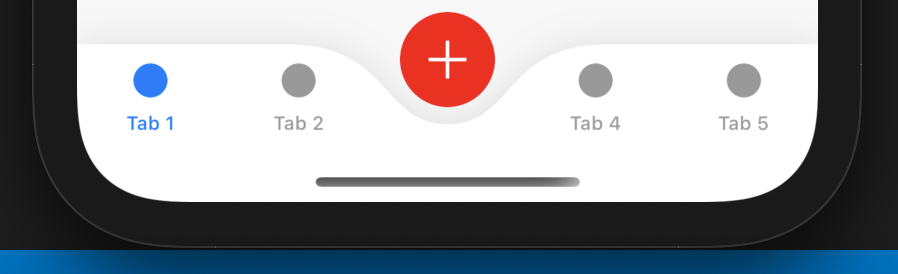

# Titanium Rounded Tab Group

A lightweight module to apply a native rounded tab groups (no custom view) in Appcelerator Titanium.

## Requirements

- [x] Titanium SDK 9.2.0+

## Example

None needed! Just include the module in your tiapp.xml and it will do the rest. No `import`/`require` needed.

## Author

Hans Knöchel

## License

MIT